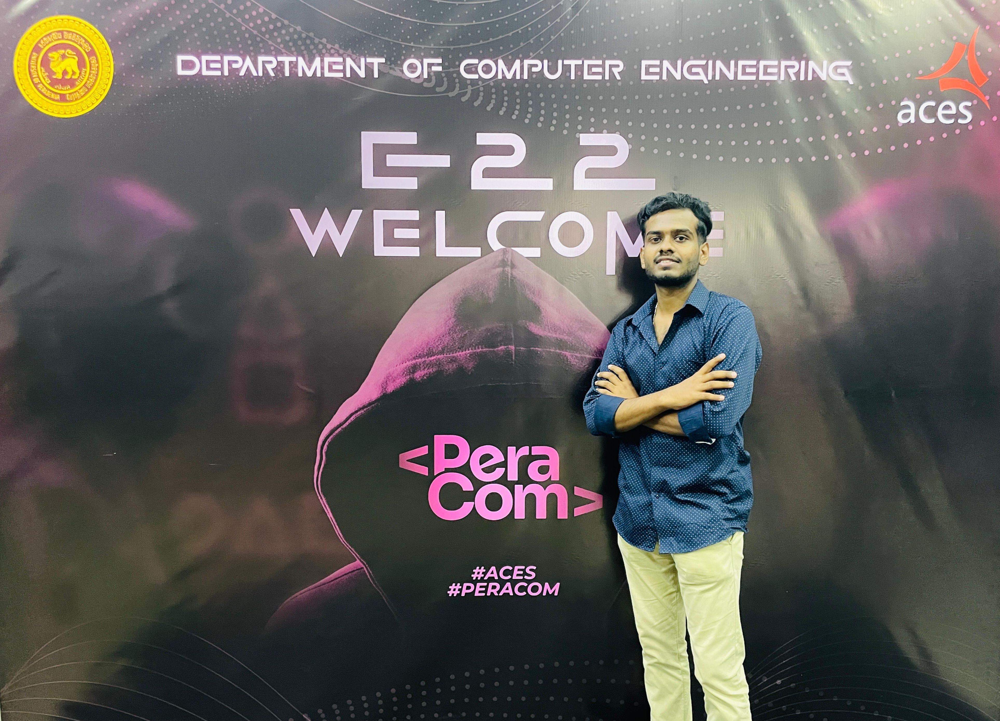

<h1 align="center">Hi 👋, I'm Bhagya Karunanayake</h1>
<h3 align="center">Computer Engineering Student 🎓</h3>
<h4 align="center">Passionate about AI & Ml, problem-solving, and Passionate Learner 💻✨</h4>

  
  
  

  <em>"Sometimes it takes a mistake to learn from it."</em>
  

 

## 🚀 About me  

- 🎓 **Computer Science & Engineering Student** with a passion for technology and innovation
- 🌱 I’m currently learning computer engineering at University of Peradeniya.
- 💻 **Full-Stack Developer** experienced in both frontend and backend technologies.
- 🌱 Currently exploring **AI/ML**, **Data Structures & Algorithms**, and **Web Development**
- 💞️ I’m looking to collaborate on open-source AI, robotics, ML projects.
- 🎯 Always eager to learn new technologies and contribute to open-source projects
- ⚡ Fun fact: All models are wrong,but some are useful !

 

## 🌐 Connect with me:

  
  &nbsp;
  
  &nbsp;
   
  &nbsp;
  
  &nbsp;

  

 

🏠 Mirigama, Gampha, Sri Lanka
 

📞 +94 763263100

 

## 💻 Programming Languages:

 
    
   
  
   
  

## 🌐 Web Technologies:

  
  
  
  
  

## 🗄️ Databases:

   
  <!-- 
   -->

## 🛠️ Tools & Technologies:

 
  
  
  
  

## 🤖 Robotics & Embedded Systems:

  
  
  

## 🔧 Automation & Workflow Tools

### 🛠️ Cloud & DevOps

---

 

## 🚀 Current Focus:
- 🌐 **Full-Stack Web Development** (MERN Stack)
- 🔌 **Computer Networking** 
- 🧠 **Machine Learning** and **Artificial Intelligence** fundamentals
- 🔐 **Cybersecurity** fundamentals
- ☁️ **Data Sturctures & Algorithms**

 

## 📊 GitHub Stats:

  
  

  

 

## 🐍 Contribution Graph:

  

 

## 📈 Profile Views:

  

  <h3>💫 "The best way to predict the future is to create it." 💫</h3>
  
<em>Let's connect and build something amazing together!</em>

     

<!---
zerokali20/zerokali20 is a ✨ special ✨ repository because its `README.md` (this file) appears on your GitHub profile.
You can click the Preview link to take a look at your changes.
--->
