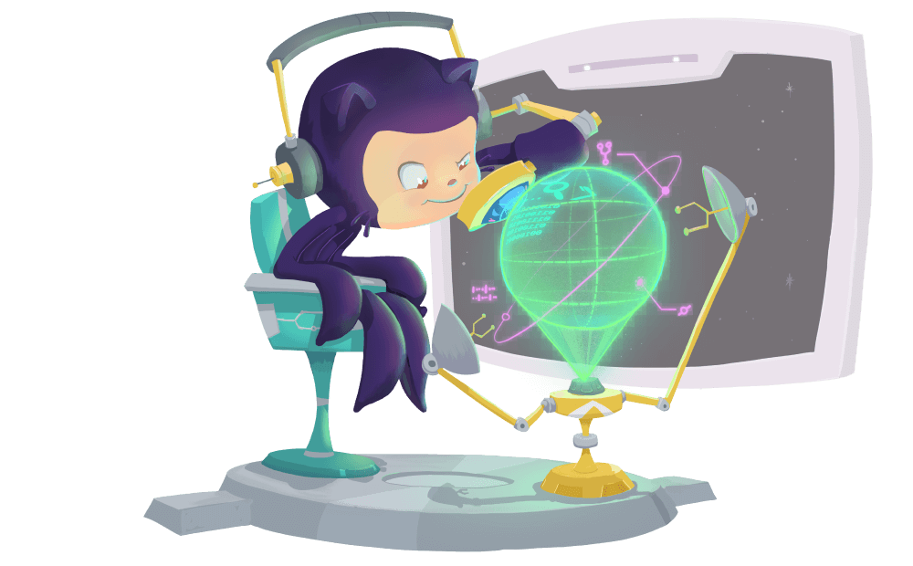
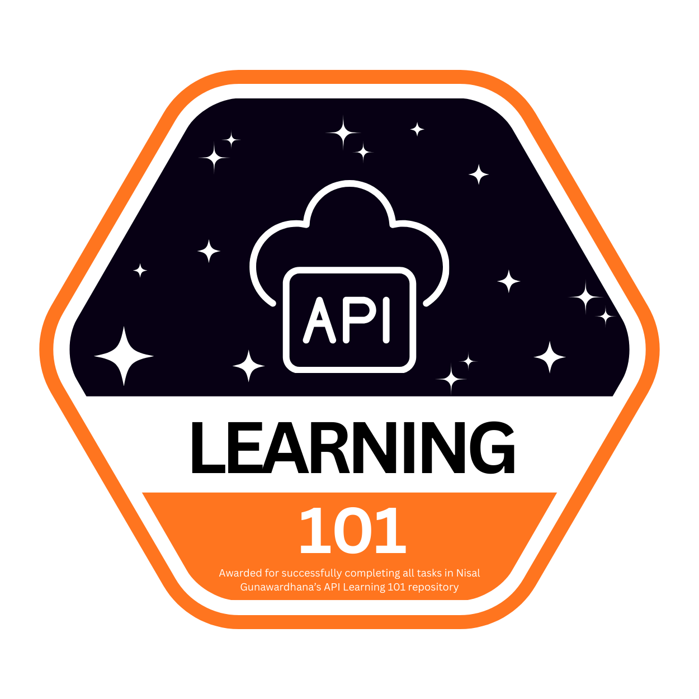
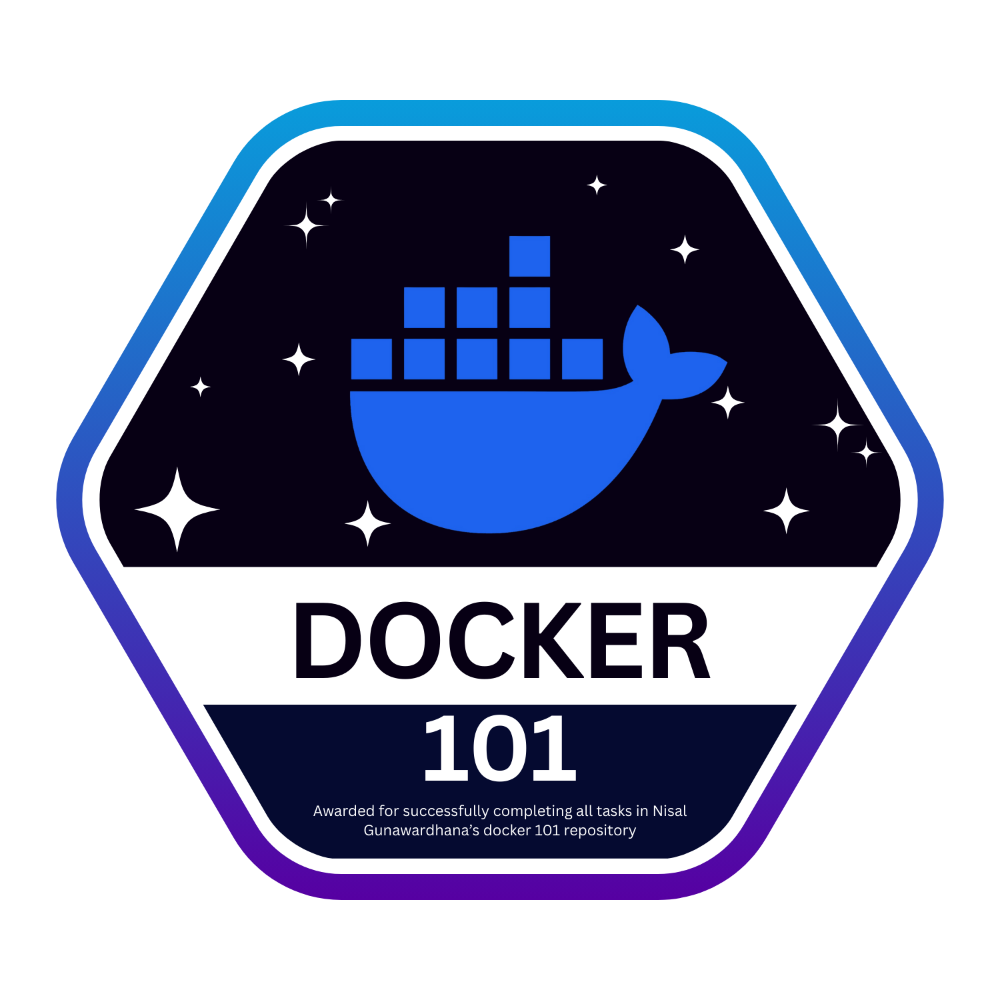
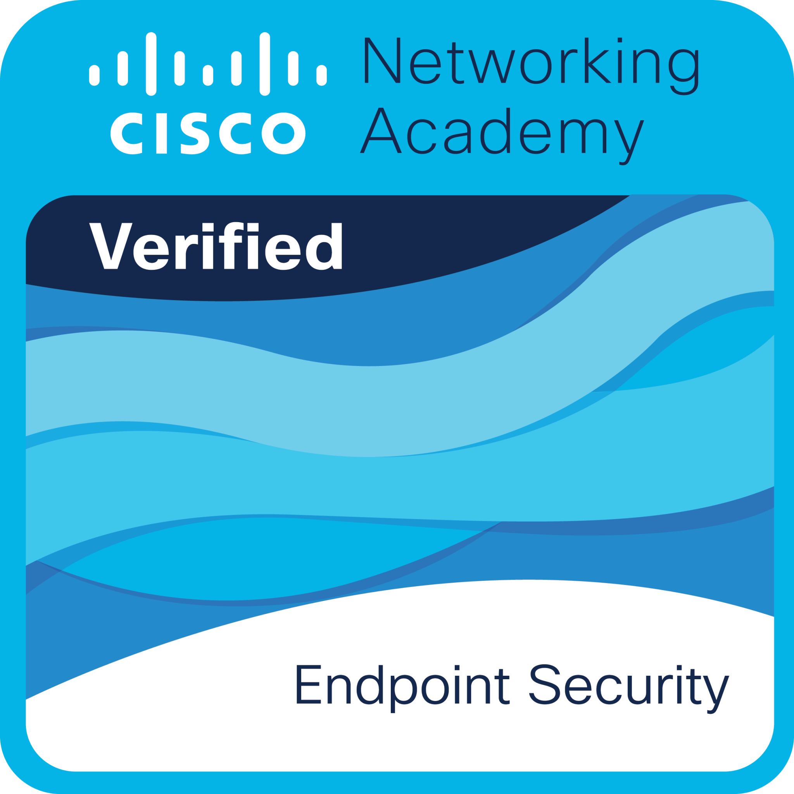

<!-- ═══════════════════════════════════════════════════════════════════════ -->
<!-- 🌊  HEADER BANNER                                                      -->
<!-- ═══════════════════════════════════════════════════════════════════════ -->

  

<!-- ═══════════════════════════════════════════════════════════════════════ -->
<!-- ⌨️  TYPING ANIMATION                                                   -->
<!-- ═══════════════════════════════════════════════════════════════════════ -->

  

  <em>"Sometimes it takes a mistake to learn from it."</em>

<!-- ═══════════════════════════════════════════════════════════════════════ -->
<!-- 📊  PROFILE BADGES                                                     -->
<!-- ═══════════════════════════════════════════════════════════════════════ -->

  
  &nbsp;
  
  &nbsp;
  
  &nbsp;
  

---

<!-- ═══════════════════════════════════════════════════════════════════════ -->
<!-- 🎨  HERO ILLUSTRATIONS                                                 -->
<!-- ═══════════════════════════════════════════════════════════════════════ -->

  
  &nbsp;&nbsp;&nbsp;&nbsp;
  
  &nbsp;&nbsp;&nbsp;&nbsp;
  

---

<!-- ═══════════════════════════════════════════════════════════════════════ -->
<!-- 🚀  ABOUT ME                                                           -->
<!-- ═══════════════════════════════════════════════════════════════════════ -->

##  &nbsp;About Me

- 🎓 **Computer Science & Engineering Student** with a passion for technology and innovation
- 🌱 I'm currently learning computer engineering at University of Peradeniya.
- 💻 **Full-Stack Developer** experienced in both frontend and backend technologies.
- 🌱 Currently exploring **AI/ML**, **Data Structures & Algorithms**, and **Web Development**
- 💞️ I'm looking to collaborate on open-source AI, robotics, ML projects.
- 🎯 Always eager to learn new technologies and contribute to open-source projects
- ⚡ Fun fact: All models are wrong,but some are useful !

 

---

<!-- ═══════════════════════════════════════════════════════════════════════ -->
<!-- 🌐  CONNECT WITH ME                                                    -->
<!-- ═══════════════════════════════════════════════════════════════════════ -->

##  &nbsp;Connect with Me

  
  &nbsp;
  
  &nbsp;
  
  &nbsp;
  
  &nbsp;
  

  📍 &nbsp;<strong>Mirigama, Gampaha, Sri Lanka</strong> 
  📞 &nbsp;<strong>+94 763263100</strong> 
  ✉️ &nbsp;<strong>bhagikaru2003@gmail.com</strong>

 

---

<!-- ═══════════════════════════════════════════════════════════════════════ -->
<!-- 🧰  TECH STACK                                                         -->
<!-- ═══════════════════════════════════════════════════════════════════════ -->

##  &nbsp;Tech Stack

### 💻 Programming Languages

  
  &nbsp;
  
  &nbsp;
  
  &nbsp;
  
  &nbsp;
  

### 🌐 Web Technologies

  
  &nbsp;
  
  &nbsp;
  
  &nbsp;
  
  &nbsp;
  

### 🗄️ Databases

  
  &nbsp;
  

### 🛠️ Tools & Technologies

  
  &nbsp;
  
  &nbsp;
  
  &nbsp;
  

### 🤖 Robotics & Embedded Systems

  
  &nbsp;
  
  &nbsp;
  

### 🔧 Automation & Workflow Tools

  
  &nbsp;
  

### ☁️ Cloud & DevOps

  
  &nbsp;
  
  &nbsp;
  
  &nbsp;
  
  &nbsp;
  

---

<!-- ═══════════════════════════════════════════════════════════════════════ -->
<!-- 🏆  CERTIFICATIONS & ACHIEVEMENTS                                      -->
<!-- ═══════════════════════════════════════════════════════════════════════ -->

## 🏆 Certifications & Achievements

  &nbsp;
  &nbsp;
  &nbsp;
  &nbsp;
  &nbsp;
  &nbsp;
  &nbsp;
  &nbsp;
  &nbsp;
  &nbsp;
  

---

<!-- ═══════════════════════════════════════════════════════════════════════ -->
<!-- 🎯  CURRENT FOCUS                                                      -->
<!-- ═══════════════════════════════════════════════════════════════════════ -->

## 🚀 Current Focus

  
  &nbsp;
  
  &nbsp;
  
  &nbsp;
  
  &nbsp;
  

---

<!-- ═══════════════════════════════════════════════════════════════════════ -->
<!-- 🐍  CONTRIBUTION SNAKE                                                 -->
<!-- ═══════════════════════════════════════════════════════════════════════ -->

  

---

<!-- ═══════════════════════════════════════════════════════════════════════ -->
<!-- ✨  FOOTER                                                             -->
<!-- ═══════════════════════════════════════════════════════════════════════ -->

  <h3>💫 "The best way to predict the future is to create it." 💫</h3>
  
<em>Let's connect and build something amazing together!</em>

  

  

<!---
zerokali20/zerokali20 is a ✨ special ✨ repository because its `README.md` (this file) appears on your GitHub profile.
You can click the Preview link to take a look at your changes.
--->
